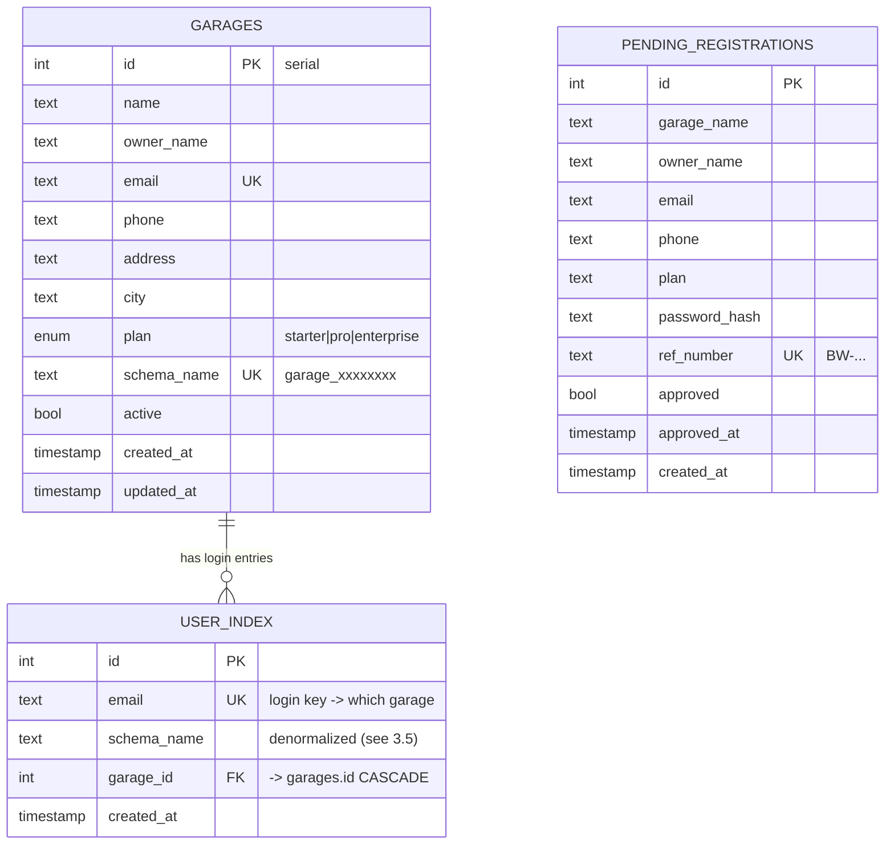
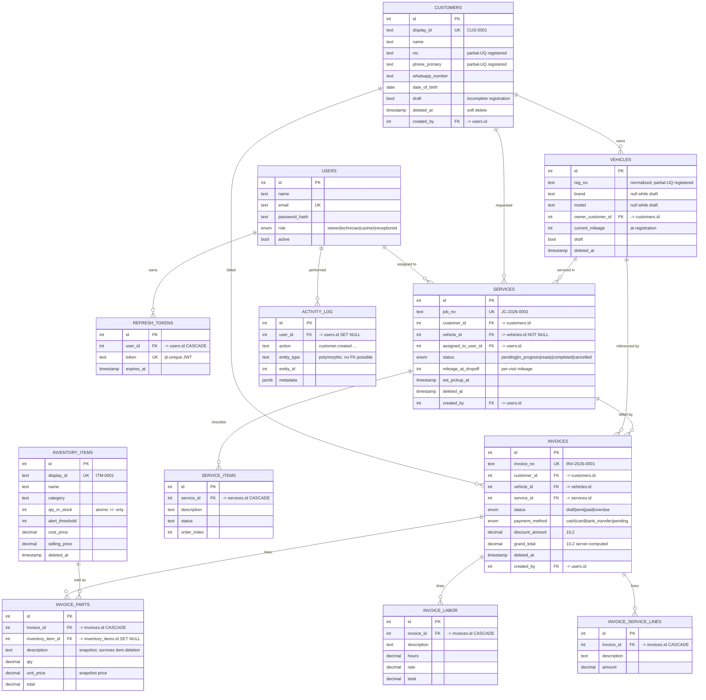

# BayWork — Database ER Diagram & Design Theory

*Matches the live schema (July 2026). Every garage gets its own PostgreSQL schema; the
`public` schema is the shared registry. PK = primary key, FK = foreign key, UQ = unique.*

## 1. Public schema (shared registry — one per installation)



## 2. Tenant schema (one copy per garage — NO garage_id anywhere; isolation = schema)



## 3. The theory behind the decisions

### 3.1 Why customers have NO "vehicles" column (your question)
A customer's vehicles are found through **`vehicles.owner_customer_id → customers.id`** —
the FK to the primary key IS the connection. Storing a `vehicle_count` (or a list) on the
customer row would **duplicate derivable data**, breaking normalization: every vehicle
insert/delete/re-assignment would have to update two tables, and any missed update makes
the count silently wrong (an *update anomaly*). Rule: **store facts once; derive the rest**
— the UI's count is a `COUNT(*)` subquery over the FK, always correct by construction.

### 3.2 Normal forms in practice
- **1NF** — every column atomic: no comma-separated lists (that's *why* no "vehicles" text column).
- **2NF/3NF** — non-key columns depend on the key only: vehicle facts live on vehicles,
  not repeated per service; customer contact lives once, referenced by id everywhere.
- Line items are **separate tables** (invoice_parts/labor/service_lines), one row per line —
  the relational answer to "an invoice has many lines".

### 3.3 Keys
- **Surrogate PKs** (`serial id`) everywhere: stable, small, never carry meaning.
- **Natural identifiers** (`reg_no`, `phone`, `email`, `display_id`) are UNIQUE columns,
  *not* PKs — they can change or be re-used; a PK must never change.
- **Partial unique indexes** (`WHERE deleted_at IS NULL AND draft = false`) enforce
  "unique among the living, registered rows" — plain UNIQUE can't express a lifecycle.

### 3.4 ON DELETE strategy (three deliberate tiers)
| Behavior | Used for | Reasoning |
|---|---|---|
| `CASCADE` | tokens, checklist items, invoice lines | Meaningless without their parent |
| `SET NULL` | invoice_parts→inventory, activity_log→users | History outlives the referenced row; the snapshot columns (description/price) keep the record readable |
| `RESTRICT` (default) + **soft delete** | customers, vehicles, services, invoices | Business records are never hard-deleted; `deleted_at` hides them while every FK stays valid |

### 3.5 Deliberate denormalization (documented exceptions)
- `user_index.schema_name` duplicates `garages.schema_name` — a **login hot-path** optimization:
  one lookup resolves email → schema without a join, on every request. Safe because a schema
  name never changes after provisioning. *Denormalize only immutable data, and write it down.*
- `invoice_parts.description/unit_price` snapshot the inventory item at sale time — an invoice
  is a legal record and must not rewrite itself when prices change later.

### 3.6 Polymorphic reference (the one FK that can't exist)
`activity_log.entity_type + entity_id` points at *any* table, so SQL can't declare one FK for it.
This is a standard trade-off for audit logs: integrity is enforced by application code, and the
log is append-only so dangling ids are acceptable history.

### 3.7 FK columns are indexed
Postgres indexes PKs automatically but **not** FK columns. Every FK used in joins or
cascades gets an explicit index (owner_customer_id, customer_id, invoice_id on each line
table, service_id, user_id…) — without them each cascade/join is a sequential scan.

### 3.8 Multi-tenancy by schema
Tenant tables carry **no `garage_id`** — a `garage_id` column on every row (row-level
tenancy) is the common alternative, but schema-per-tenant gives hard isolation
(`SET search_path`), per-tenant backup/restore, and makes cross-tenant leaks structurally
impossible rather than merely forbidden by WHERE clauses.
```
