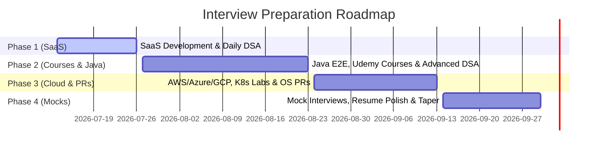

# Weekly Execution Plan & Interview Prep Schedule
**Timeline:** July 13, 2026 — October 1, 2026 (approx. 11 weeks)
**Constraint:** Onsite WSO2 Internship (7:30 AM — 7:30 PM) | Tight 6-hour sleep limit

---

## 🕒 The Daily Timetable

This schedule is tight, high-volume, and designed to optimize your energy levels.

### Weekdays (Monday — Friday)
| Time | Block | Focus / Actions |
|---|---|---|
| **05:30 AM — 05:45 AM** | Wake & Hydrate | Quick transition from sleep to alert state. No phone scrolling. |
| **05:45 AM — 07:00 AM** | 🧠 **DSA Morning Block (1.25 hrs)** | Fresh brain = hardest task. Solve **1–2 LeetCode problems** in **Java** (NeetCode 150 list). |
| **07:00 AM — 07:30 AM** | Commute & Prep | Travel to WSO2. |
| **07:30 AM — 07:30 PM** | 💼 **WSO2 Internship (12 hrs)** | Focus on your Operator Design / SRE tasks.  *Micro-tasks:* Use lunch break (15 min) for quick **Anki flashcards** review. Keep a notepad to log any bug or design choice for your STAR stories. |
| **07:30 PM — 08:00 PM** | Commute & Dinner | Get home, freshen up, eat dinner. Do not study during this block. |
| **08:00 PM — 10:30 PM** | 💻 **SaaS / Dev Block (2.5 hrs)** | **Weeks 1–2:** Build & wire BayWork SaaS backend & frontend. **Weeks 3–11:** Learn Java E2E, finish stuck Udemy courses (Fullstack/DevOps), and cloud labs. |
| **10:30 PM — 11:15 PM** | 📖 **System Design & Recall (45 mins)**| Read Donne Martin's system design primer. Write down today's DSA pattern. |
| **11:15 PM — 11:30 PM** | Wind Down | Set up tomorrow's LeetCode topic, turn off screens. |
| **11:30 PM — 05:30 AM** | 😴 **Sleep (6 hrs)** | Tight, uninterrupted sleep. |

*Weekday Study/Dev Output: ~4.5 hours/day (22.5 hours/week)*

---

### Weekends (Saturday — Sunday)
| Time | Block | Focus / Actions |
|---|---|---|
| **06:00 AM — 07:00 AM** | Wake Up & Coffee | Relaxed morning routine. |
| **07:00 AM — 10:00 AM** | 🧠 **DSA Deep Block (3 hrs)** | Harder topics (Trees, Graphs, DP). Implement cleanly in Java. Review optimal solutions. |
| **10:00 AM — 10:30 AM** | Break / Breakfast | Rest. |
| **10:30 AM — 01:30 PM** | 💻 **Core Development / Labs (3 hrs)** | **Weeks 1–2:** Heavy coding on BayWork SaaS. **Weeks 3–11:** Practice labs (Docker, Kubernetes, AWS/Azure/GCP setups). |
| **01:30 PM — 02:30 PM** | Lunch & Rest | Recharge. |
| **02:30 PM — 05:30 PM** | 📚 **Theory & Udemy Courses (3 hrs)** | Java core details, DevOps course modules, AWS/GCP, Linux internals. |
| **05:30 PM — 06:00 PM** | Break | Quick walk or snack. |
| **06:00 PM — 07:30 PM** | 🌐 **System Design Block (1.5 hrs)** | Sketch architectures (Rate Limiters, Chat, Object Storage, Container Registries). |
| **07:30 PM — 08:30 PM** | Dinner | Recharge. |
| **08:30 PM — 10:00 PM** | ✍️ **Medium Blog / Recall (1.5 hrs)** | Write 1 short post about a challenge you solved at WSO2 or in your SaaS. Review weekly progress. |
| **10:00 PM — 12:00 AM** | 🔋 **Free Buffer Time (2 hrs)** | Chill out, watch a video, clear your mind. Essential to prevent burnout. |
| **12:00 AM — 06:00 AM** | 😴 **Sleep (6 hrs)** | Tight sleep. |

*Weekend Study/Dev Output: 12 hours/day (24 hours/week)*
**TOTAL STUDY/DEV TIME PER WEEK: 46.5 HOURS**

---

## 🚀 The 14-Day BayWork SaaS Sprint (July 13 — July 26)

To clear your mind, you need to ship this project so it becomes a resume asset. Since the schemas and database client are already structured, you need to build the endpoints and wire them to the frontend HTML pages.

| Day | Date | Target Feature (Express API + Console Integration) |
|---|---|---|
| **Day 1** | Mon Jul 13 | Boot docker database, configure `drizzle.config.ts`, run DB migrations/seeding. Verify API logs. |
| **Day 2** | Tue Jul 14 | Implement JWT authentication routes: `/api/auth/register`, `/api/auth/login`, and `/api/auth/refresh`. |
| **Day 3** | Wed Jul 15 | Build Customer API CRUD endpoints (`/api/customers`) with request validation (Zod). |
| **Day 4** | Thu Jul 16 | Build Vehicle API CRUD endpoints (`/api/vehicles`) and link them to Customer owners. |
| **Day 5** | Fri Jul 17 | Build Services (Job Cards) API CRUD endpoints (`/api/services`) and `/api/services/:id/items`. |
| **Day 6** | Sat Jul 18 | **Frontend Integration:** Wire `login.html` and `register.html` to backend endpoints using vanilla JS `fetch()`. Store JWTs in cookies. |
| **Day 7** | Sun Jul 19 | **Frontend Integration:** Wire `dashboard.html` and `customers.html` table views and detail forms. |
| **Day 8** | Mon Jul 20 | Build Inventory API CRUD endpoints (`/api/inventory`) with stock thresholds & alert levels. |
| **Day 9** | Tue Jul 21 | Build Invoice API CRUD endpoints (`/api/invoices`) including automated parts/labor calculations. |
| **Day 10** | Wed Jul 22 | Build Activity Log hooks on crucial state changes (e.g., job completed, invoice paid) + PDF print view endpoint. |
| **Day 11** | Thu Jul 23 | **Frontend Integration:** Wire `services.html` (Job Card tables and status updates). |
| **Day 12** | Fri Jul 24 | **Frontend Integration:** Wire `invoices.html` and `inventory.html` to the backend. |
| **Day 13** | Sat Jul 25 | **Deployment & Tunneling:** Dockerize the entire application (`Dockerfile` + `docker-compose.yml`) and set up a **Cloudflare Tunnel** for public access. |
| **Day 14** | Sun Jul 26 | **Testing & Launch:** Run through all user flows end-to-end. Fix final bugs, write a clean README, and post a launch announcement. **Finished!** |

---

## 📅 The 11-Week Multi-Phase Roadmap (Leading to Oct 1)

### Phase 1: SaaS Launch & DSA Foundation (Weeks 1–2: Jul 13 — Jul 26)
*   **Goal:** Ship the BayWork SaaS to local production via Cloudflare Tunnel. Keep DSA warm.
*   **DSA focus:** Arrays, Hashing, Two Pointers.
*   **SRE/Internship action:** Take notes on K8s controller patterns/Harbor registry actions for interviews.

### Phase 2: Java E2E, Udemy Courses & Advanced DSA (Weeks 3–6: Jul 27 — Aug 23)
*   **Goal:** Clear stuck Udemy courses (Fullstack/DevOps) and build depth in Java.
*   **DSA focus:** Sliding Window, Stack, Binary Search, Linked Lists, Trees.
*   **Java topics:** OOP, JVM memory model (stack vs heap), Collections framework, Multithreading & Concurrency.
*   **SRE focus:** Linux networking internals, system calls, cgroups, namespaces, and Docker files.

### Phase 3: Cloud Platforms, K8s & Open Source PRs (Weeks 7–9: Aug 24 — Sep 13)
*   **Goal:** Gain credentials/project-proof for Cloud (AWS/Azure/GCP) and K8s, and merge 2 PRs.
*   **DSA focus:** Tries, Heaps, Backtracking, Graphs.
*   **SRE/Cloud focus:** Setup monitoring/logging stack (Prometheus/Grafana). Learn AWS Core (S3, EC2, IAM, EKS).
*   **Open Source:** 
    *   **PR #1 (by Aug 30):** Docs or example fix in Harvester/Longhorn.
    *   **PR #2 (by Sep 13):** Code change in kube-vip or longhorn-manager (good-first-issue).

### Phase 4: Full Mocks, STAR Polish & Sleep Taper (Weeks 10–11: Sep 14 — Sep 30)
*   **Goal:** Peak for the interviews. Break the mental barriers.
*   **DSA focus:** Timed mock solving (NeetCode 150 random), Dynamic Programming review.
*   **Behavioral:** Polish 6–8 STAR stories (including the WSO2 registry project and the BayWork SaaS design decisions).
*   **Logistics:** Send out resumes with referrals, polish LinkedIn/GitHub, and start mock interviews with real peers on Pramp.

---

## ⚡ Mental Rules to Break the "Planning Mode" Freeze

1.  **The 25-Minute Commitment:** Whenever you feel stuck or overwhelmed, set a timer for **25 minutes** and commit to writing just one block of code, solving one easy LeetCode problem, or reading one article. Once you start, momentum takes over.
2.  **Strict Block Isolation:** Do not think about Kubernetes while you are doing LeetCode. Do not think about LeetCode while you are working on BayWork. Do not think about anything else when you are sleeping. Isolate your focus.
3.  **Action Precedes Motivation:** Do not wait until you "feel like it" to start. You will be tired after WSO2. Start anyway. Write 5 lines of code. Action creates energy, not the other way around.
4.  **Accept Imperfection:** A buggy endpoint or a LeetCode problem you need to check the solution for is progress. Staring at an empty plan is not. Write messy code, then refactor.
